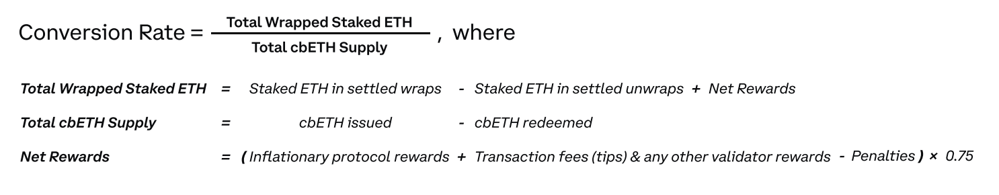
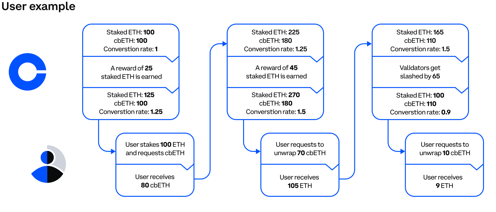

# Collateral Plugin - Coinbase - CbETH 
[Gitcoin bounty 29506](https://gitcoin.co/issue/29506)

## Plugin description

### Economics

__What is cbEth__

Coinbase Wrapped Staked ETH (“cbETH”) is a utility token that represents Ethereum 2 (ETH2), which is ETH staked through Coinbase. Over time, the price of cbETH will likely deviate from ETH because cbETH represents 1 staked ETH plus all of its accrued staking interest starting from when cbETH's conversion rate and balance were initialized (June 16, 2022 19:34 UTC). cbETH is minted exclusively by Coinbase.

cbETH can be sold or sent off-platform, while ETH2 will remain locked-up until a future protocol upgrade.

__How does it work?__

Reward for holding cbEth is calculated via a conversion rate (or exchange rate `exRate` for now) With this formula:

```
Eth_received = exRate * cbEth_sent
```

The conversion rate is the rate at which cbETH will be issued or redeemed
burned relative to the amount of staked ETH being wrapped. It is a function
of the amount of ETH staked, any post-commission rewards earned, any
penalties imposed, and total cbETH token supply (see diagram below). The
conversion rate can be pulled from the smart contract.
 


At first mint, there was a 1:1 ratio (2022-06-12 at 18:04:35) between staked ETH on Coinbase and cbETH. This ratio will deviate over time for the reasons
explained above and now (2022-11-22 at 18:23:10) is 1.016390352731083689.
Nevertheless convertion rate can decrease if a slashing occurs.

An example for a user:



__Implementation__

Coinbase Wrapped Staked ETH can be found at address [0xBe9895146f7AF43049ca1c1AE358B0541Ea49704](https://etherscan.io/token/0xbe9895146f7af43049ca1c1ae358b0541ea49704)

Source code for StakedTokenV1, cbETH is a StakedTokenV1 here: [github](https://github.com/coinbase/wrapped-tokens-os)


__Limitations and future__

- _Exchange cbETh for Eth is limited_: All ETH are currently locked in a smart contract and will not become available for trading until the merge and a following upgrade are complete. In the meantime, Coinbase is making it possible for ETH holders to wrap their ETH into cbETH, which is a liquid representation of ETH that can be traded or transferred. You can unwrap your cbETH and receive the underlying ETH. The amount of ETH you’ll receive is equal to the amount of cbETH multiplied by the conversion rate.
But this is only possible inside coinbase, not in chain, until the `Shanghai upgrade` allows for staking withdrawals and coinbase makes a contract to redeem 
cbEth.

- _Slashing risk:_
Ethereum’s consensus mechanism has several rules intended to protect
the integrity of the network. If any of these rules are broken (voluntarily
or not), a portion of the staked ETH is removed. Some examples include
validator downtime and double-signing. We take a number of measures
to mitigate these risks, including but not limited to: client diversification,
node operator diversification, and geographical / hosting diversification
(more detail under Coinbase Advantages below). These mitigants aren’t a
panacea though. In the event of a validator or protocol failure, this network
“slashing” could reduce the amount of staked ETH held by Coinbase on
behalf of cbETH holders. In this event, the cbETH<>staked-ETH conversion
rate would decrease–just as it increases when the network distributes
rewards for successfully proposing and validating blocks.

For more information see [Coinbase cbETH whitepaper](https://www.coinbase.com/cbeth/whitepaper)

### Files
_Plugin contracts_
- Collateral contract [CbEthCollateral.sol](./CbEthCollateral.sol)
- StakedTokenV1 interfaces (cbEth is a StakedTokenV1 see [coinbase github](https://github.com/coinbase/wrapped-tokens-os/blob/main/contracts/wrapped-tokens/staking/StakedTokenV1.sol) and [coinbase whitepaper](https://www.coinbase.com/cbeth/whitepaper) [IStakedToken](./IStakedToken.sol) and [IStakedController](./IStakedToken.sol)

_Tests contracts_
- Mock contracts [cbEthMock](../mocks/CBETHMock.sol) and [CbEthControllerMock](../mocks/CbEthControllerMock.sol)

### Plugin Units

 * __Collateral token `{tok}`__ is `cbETH`.  
   
   cbETH (Coinbase Wrapped Staked ETH) is a ERC20 utility token, which is a liquid representation of coinbase customers staked-ETH.
   cbETH gives Coinbase customers the option to sell, transfer, or otherwise use their staked ETH in dapps while it remains locked.
 * __Reference unit `{ref}`__ is `ETH`.

   Convertion rate is defined within [coinbase cbETH contract](https://etherscan.io/address/0xBe9895146f7AF43049ca1c1AE358B0541Ea49704) function "exchangeRate()".
 * __Target unit `{target}`__ equal to `{ref}` that is `ETH`.
   
   Natural unit is simply ETH.
   targetPerRef() is a 1:1 constant function
 * __Unit of Account `{UoA}`__ is `USD`


 ### Pluggin Functions
 
 __`refPerTok()`__
 
 Uses cbEth contract exchangeRate() function wich increases over time due to staking rewards.

 _Conversion Rate = Total Wrapped Staked ETH / Total cbETH Supply_ 
  - Total Wrapped Staked ETH = Staked Eth - Staked ETH unwrapped + Net Rewards
  - Total cbETH Supply = cbEth issued - cbEth redeemed
  - Net Rewards = 75% of (Inflationary protocol rewards + validator rewards - penalties)

 The conversion rate would decrease (just as it increases when the network distributes rewards for successfully proposing and validating blocks) in case of network “slashing” reducing the amount of 
 staked ETH held by Coinbase. In this case plugin immediately default. (i.e, permanently set `status()` to `DISABLED`)

TLDR; 
- `cbEth.exchangeRate()` as `refPerTok() {ref}` is good market rate for 1 `{tok}` 
- `cbEth.exchangeRate()` as `refPerTok()`refPerTok()` is nondecreasing over time.

 __`targetPerRef()`__

 Since `{target} == {ref} == 'ETH'` targetPerRef() simply return 1 ( `FIX_ONE` in solidity FixedPoint notation). The chief constraints on `{target}` are satisfied:
- `targetPerRef() {target}` is a good price (1:1). 
- `targetPerRef()` is _constant_ an equal to 1.


__`strictPrice()`__
Calcualted via:
- {UoA/tok} chainlink feed for cbEth/USD (address 0x67eF3CAF8BeB93149F48e8d20920BEC9b4320510)
- {ref/tok} as a result of `refPerTok()` 
Result is {UoA/tok} = {UoA/ref} * {ref/tok}

__`refresh()`__
- Checks refPerTok() prices do not decreased (Disables plugin if it does)
and updates status and price

__`pricePerTarget()`__
- {UoA/target} chainlink feed for ETH/USD (address 0x5f4eC3Df9cbd43714FE2740f5E3616155c5b8419)

__`claimRewards()`__

- Claim rewards earned by converting cbEth to ETH should recieve:

 `recived_ETH = cbEth * exRate / 1e18 in ETH` 
 
 Since `exRate > 1e18` cbEth gives a reward in Eth equal to 
 
 `cbETH * (exRate - 1e18)` 

- This is unavailable until the Shanghai upgrade allows for staking withdrawals.
CbEthControllerMock contract will be used to test when available.
- For now just emits `RewardsClaimed(staked, reward)` where 

`reward = {tok} balance * (refPerTok()- 1e18)`

__`status()`, `isCollateral()` and `targetName()`__
- Implemeted in `Abstract Collateral` Parent class

__`price(bool)`, `bal(address)`, `erc20()`, `erc20Decimals()` and `maxTradeVolume()`__
- Implemeted in `Asset` contract, inherited from `Abstract Collateral`

### Tests

Added cbEthCollateral test to [plugin tests](../../../test/plugins/Collateral.test.ts) and [fixture](../../../test/fixtures.ts)
Added cbEthCollateral to [integrated tests](../../../test/integration/individual-collateral/CbEthCollateral.test.ts)

#### yarn slither
warnings:

```
CbEthCollateral.refresh().errData (contracts/plugins/assets/CbEthCollateral.sol#72) is a local variable never initialized
```

```
CbEthCollateral.refresh() (contracts/plugins/assets/CbEthCollateral.sol#58-85) ignores return value by chainlinkFeed.price_(oracleTimeout) (contracts/plugins/assets/CbEthCollateral.sol#70-76)
```

Can't be avoided. `chainlinkFeed.price_(oracleTimeout)` is only used to check 
oracle avaibility. No use it's data nor `errData`.

#### yarn test:plugin

cbEthCollateral contract added to [test/fixture.ts](../../../test/fixtures.ts) basket.
Specific test in [test/plugins/Collateral.test.ts](../../../test/plugins/Collateral.test.ts)
and [test/plugins/Asset.test.ts](../../../test/plugins/Asset.test.ts)

- Result:
```test
  204 passing (4m)
  3 pending
```

- Pendings:
```
  CbEth Collateral #fast
    - Should not allow missing controller
  Gas Reporting
    - Force Updates - Soft Default
    - Force Updates - Hard Default - ATokens/CTokens
```

#### yarn test:integration
Added [test/integration/individual-collateral/CbEthCollateral.test.ts](../../../test/integration/individual-collateral/CbEthCollateral.test.ts)

- Result:

```
  57 passing (8m)
  34 pending
```

- Pending (for cbEthCollateral), skipped since cbEth has no soft default condition.
```
Collateral Status
  - No Updates status in case of soft default because there is no soft reset
```


#### yarn test:fast
Updated [test/Furnace.test.ts](../../../test/Furnace.test.ts)
Updated [test/Main.test.ts](../../../test/Main.test.ts)
Updated [test/RToken.test.ts](../../../test/RToken.test.ts)


All tests pasing:
```
  231 passing (16m)
  4 pending
```

See [yarn test:fast log file](../../../test-fast.log)

### Deployement
   
1) Deploy [CbEthCollateral contract](./CbEthCollateral.sol) with params: 
```ts
    let fallbackPrice_: BigNumberish = fp('1')
    let chainlinkFeed_: networkConfig[chainId].chainlinkFeeds.ETH as string
    let erc20_: cbEth.address
    let maxTradeVolume_: config.rTokenMaxTradeVolume
    let oracleTimeout_: BigNumberish = ORACLE_TIMEOUT
    let targetName_: BytesLike =ethers.utils.formatBytes32String('ETH')
    let delayUntilDefault_: BigNumberish = delayUntilDefault

    const cbEthCollateralFactory = await ethers.getContractFactory('CbEthCollateral', {
      libraries: { OracleLib: oracleLib.address },
    })

    cbEthCollateral = <CbEthCollateral>(
      await cbEthCollateralFactory.deploy(
        fallbackPrice_,
        chainlinkFeed_,
        erc20_,
        maxTradeVolume_,
        oracleTimeout_,
        targetName_,
        delayUntilDefault_,
      )
    )   
```
Mainnet addresses for chainlink added in [config file](../../../common/configuration.ts).
Don't forget coinbase oracle actualises cbEth exchange rate every 4H.

2) Initialize/set the base tokens and the collateral should be ready.
3) Creata Rtoken with cbEthCollateral
4) As CbEth holder approve Rtoken adddress to transfer your cbEth (ERC20).
5) test
6) Follow [deployment](../../../docs/deployment.md).

### Submission Requirements
- [not aplicable] Twitter handle
- [not aplicable] Telegram handle
- [not aplicable] Discord handle
- [x] Source code for your Collateral plugin or plugins
- [x] An open source license
- [x] Documentation (e.g, a README file), describing the following for each plugin:
    - [x] What are the collateral token, reference unit, and target unit for this plugin?
    - [x] How does one configure and deploy an instance of the plugin?
    - [x] If the deployer should plug in price feeds, what units does your plugin expect those price feeds to be stated in?
    - [x] Why should the value (reference units per collateral token) decrease only in exceptional circumstances?
    - [x] How does the plugin guarantee that its status() becomes DISABLED in those circumstances?
    - [x] Tests demonstrating the behaviors checked by our example Collateral plugin test, which we encourage you to use as a starting template for your own testing.Particular behaviors must include:
        - [x] Deployment.
        - [x] Issuance, appreciation, and redemption of an RToken with this Collateral in its basket.
        - [x] Claiming rewards (or, if no rewards are available for this token, tests demonstrating that the claim-reward functions do nothing and don't revert)
        - [x] Correct behavior for price() when any price sources return invalid values.
        - [x] Correctly changing status() whenever that's needed in order to flag sudden or impending default.

### Acceptance Criteria
- [x] Fully implement the [ICollateral interface][icoll].
- [x] Satisfy the correctness properties given in the Collateral plugin-writing howto.
- [x] Be fully permissionless once deployed.
- [x] Be documented with cogent explanations of its economics.
- [x] Be deployable with USD as its Unit of Account.
- [x] Not be prone to relatively simple economic attacks or cough cough “highly profitable trading strategies”​
