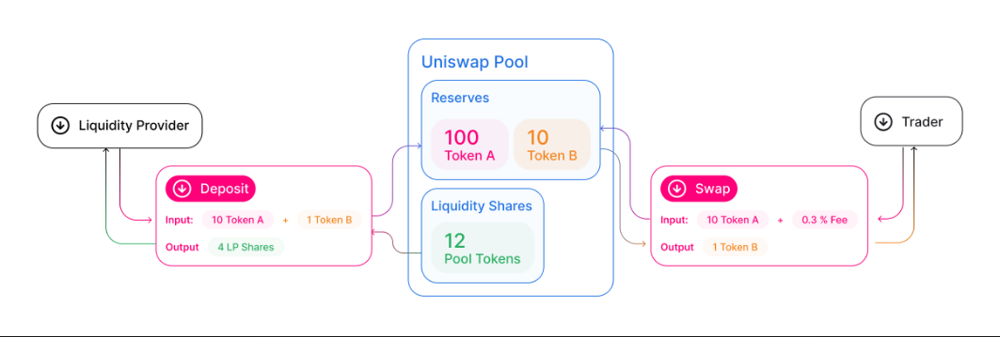
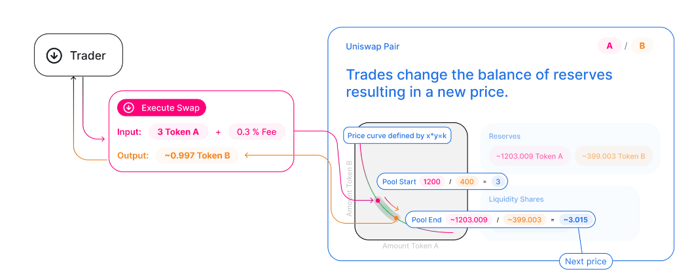

# Collateral Plugin - Uniswap V2
- [Gitcoin issue 29517](https://gitcoin.co/issue/29517)
- [Github issue 385](https://github.com/reserve-protocol/protocol/issues/385)

# Plugin description

## UniswapV2

__What is uniswapV2__

Uniswap is a protocol suite of persistent, non-upgradable smart contracts that together create an automated market maker.
This protocol aims to facilitate peer-to-peer market making and swapping of ERC-20 tokens on the Ethereum blockchain.

Whenever a trade occurs, a 0.3% fee is charged to the transaction sender. This fee is distributed pro-rata to all Liquidity Providers (LPs) in the pool upon completion of the trade.

In UniswapV2 protocol liquidity tokens are generated when a user adds liquidity
to a pool that swaps tokenA/tokenB. This liquidity tokens are redeemable for 
an amount of tokenA + tokenB proportional to the pool liquidity total amount 
plus the proportional fee allocation.

__How does it work?__

UniswapV2 is an automated liquidity protocol powered by a constant product formula and implemented in a system of non-upgradeable smart contracts on the Ethereum blockchain. It obviates the need for trusted intermediaries, prioritizing decentralization, censorship resistance, and security. Uniswap is open-source software licensed under the GPL.

Each Uniswap smart contract, or pair, manages a liquidity pool made up of reserves of two ERC-20 tokens.

Anyone can become a liquidity provider (LP) for a pool by depositing an equivalent value of each underlying token in return for pool tokens. These tokens track pro-rata LP shares of the total reserves, and can be redeemed for the underlying assets at any time.

Pairs act as automated market makers, standing ready to accept one token for the other as long as the “constant product” formula is preserved. This formula, most simply expressed as x * y = k, states that trades must not change the product (k) of a pair’s reserve balances (x and y). Because k remains unchanged from the reference frame of a trade, it is often referred to as the invariant. This formula has the desirable property that larger trades (relative to reserves) execute at exponentially worse rates than smaller ones.

In practice, Uniswap applies a 0.25% fee to trades, which is added to reserves. As a result, each trade actually increases k. This functions as a payout to LPs, which is realized when they burn their pool tokens to withdraw their portion of total reserves. A 0.05% fee withheld as a protocol-wide charge can be applied.

Because the relative price of the two pair assets can only be changed through trading, divergences between the Uniswap price and external prices create arbitrage opportunities. This mechanism ensures that Uniswap prices always trend toward the market-clearing price.

See [UniswapV2 documentation](https://docs.uniswap.org/contracts/v2/overview) for more details.

## Implementation

First we will explore some maths behind UniswapV2 protocol.
[Uniswap v2 Core Whitepaper](https://docs.uniswap.org/whitepaper.pdf)
gives us technical details for the core contract, as well as the factory contract.

UniswapV2 uses a constant product formula to decide how much a swap will
return. This means at any time you trade: 
$$x \cdot y = k = constant$$

Where $x$ and $y$ are tokenA and tokenB reserves, respectively.

__Swap with no fees:__

When a user trade $\Delta x$ for $\Delta y$ tokens, given $\alpha = \dfrac{\Delta x}{x_0}$ and $\beta = \dfrac{\Delta y}{y_0}$
$$x_1 = x_0 + \Delta x$$
$$y_1 = y_0 - \Delta y$$
Still 
$$x_1 \cdot y_1 = (x_0 + \Delta x) \cdot (y_0 - \Delta y) = k$$

Developing:

$$x_0 \cdot y_0 - x_0 \cdot \Delta y + \Delta x \cdot y_0 - \Delta x \cdot \Delta y = k$$
$$\cancel{k} - x_0 \cdot \Delta y + \Delta x \cdot y_0 - \Delta x \cdot \Delta y = \cancel{k}$$
$$\Delta y \cdot (x_0 + \Delta x) = \Delta x \cdot y_0$$
then 
$$\Delta y = \dfrac{\Delta x \cdot y_0}{x_0 + \Delta x} = \dfrac{ \frac{\Delta x}{x_0} y_0 }{1 + \frac{\Delta x}{x_0} } = \dfrac{\alpha}{1+\alpha} \cdot y_0$$
and 
$$\Delta x = \dfrac{\Delta y \cdot x_0}{y_0 - \Delta y} = \dfrac{ \frac{\Delta y}{y_0} x_0 }{1 - \frac{\Delta y}{y_0} } = \dfrac{\beta}{1-\beta} \cdot x_0$$

Note:
$$\beta = \dfrac{\alpha}{1+\alpha}$$
$$\alpha = \dfrac{\beta}{1-\beta}$$

__Swap with fees:__

Now let's add a fee rate $\eta = 0.3 \%$ in total and $\lambda  = 1 - \eta = 99.7 \%$
$$\alpha' = \dfrac{\Delta x_{fee}}{x_0} =  \dfrac{\Delta x - \eta \cdot \Delta x} {x_0} = (1-\eta) \cdot \dfrac{\Delta x}{x_0} = (1-\eta) \cdot \alpha = \lambda \alpha $$
thus 
$$\Delta y  = \dfrac{\alpha'}{1+\alpha'} \cdot y_0 = \dfrac{\lambda \alpha}{1+\lambda \alpha} \cdot y_0 $$
$$\Delta x = \dfrac{\Delta x_{fee}}{\lambda} = \dfrac{1}{\lambda} \cdot \dfrac{\beta}{1-\beta} \cdot x_0$$

Note:

$$(x+\Delta x) \cdot (y - \Delta y) = k' = k + \alpha k - \beta k - \alpha \beta$$
$$k' = k \cdot (1 + \beta \dfrac{1-\lambda}{\lambda})$$

Since $\lambda < 1 \Rightarrow k' > k$

TLDR;

__`fees only increment the constant product over time.`__

__how is constant $k$ fixed ?__

Well liquidity is a token that represents 
the proportion of the total x you participatted:

$$L_{recv} = \dfrac{x_{deposited}}{x_{starting}} \cdot L_{starting}$$

Initialy $L_{starting} = \sqrt{x_{deposited} \cdot y_{desposited}}$
So 
$k = L_{starting}^2$

Supose a LP deposits $dx$ of token A and dy of token B where $\frac{dy}{y} = \frac{dx}{x} = r > 0$

New state will be:
$$x_1 = (1+r) x$$
$$y_1 = (1+r) y$$
$$l_1 = l_{rcv} + l = \dfrac{dx}{x} \cdot l + l =  r \cdot l + l = (1+r) \cdot l$$

$$x_1 \cdot y_1 = (x + dx) \cdot (y + dy) = k'$$
$$k' = (1+r)^2 \cdot x y$$
$$k' = (1+r)^2 \cdot k$$

Since it is a deposit $r>0$ then 
$(1+r)^2 >1$ and $k' > k$

But  

$$\dfrac{k'}{k} = (1+r)^2 = \left( \frac{l_1}{l} \right)^2$$

Removing liquidity works the same way but with $r<0$
giving $k'< k$ but still 

$$\dfrac{k'}{k} = \left( \frac{l_1}{l} \right)^2$$

__Risks__

Main risk is impermanent loss due to a price ratio change.

Following this formula:

$$loss = 2\cdot \dfrac{\sqrt{p_{ratio}}}{1+p_{ratio}} - 1$$

See UniswapV2 doc [Understanding Returns](https://docs.uniswap.org/contracts/v2/concepts/advanced-topics/understanding-returns) for more details.

# UniV2Collateral Plugin (for fiat pegged LP)

This pluggin assumes both TokenA and TokenB to be pegged to
some Fiat.
This way a {target} can be USD 
since targetPerRef is constant equal to $2 \cdot \sqrt{p_A \cdot p_B}$

{ref} is $\sqrt{x \cdot y}$ since $\dfrac{\sqrt{x \cdot y}}{L}$ never 
decreases due to uniswapV2 protocol properties.

- {tok} `UNI-V2`
- {ref} `UNIV2SQRT-TA-TB`
- {target} `USD`
- {UoA} `USD`

For example (DAI/USDC):
- {tok} `UNI-V2`
- {ref} `UNIV2SQRTDAIUSDC`
- {target} `USD`
- {UoA} `USD`

and targetPerRef = 2

Please follow: 
[UniV2Collateral docs](./UniV2Collateral.md) for more details.
(in particular `refPerTock` non decresing nature demonstration).

# UniV2HNonFiatCollateral Plugin (for non fiat pegged LP)

Similar to UniV2Collateral Plugin, but assumes at least one token not to be pegged to fiat.

If we choose USD as {target} there is no constant targetPerRef.
Even if only one token isn't pegged to fiat:

Lets say $x$ is pegged to 1 USD but $y$ is not. 
Still {ref} = sqrt(x*y) and when $y$ prices changes arbitrage
will change the pool ratio meaning that reddemable x and y ratio
will change over time and we can't give a constant targetPerRef value
since total liquidity value in terms of $\sqrt{xy}$ will change.

This is very similar to impermanet loss (see [UniswapV2 docs](https://docs.uniswap.org/contracts/v2/concepts/advanced-topics/understanding-returns))

In order to solve this problem we can choose {target} = {ref}, losing
the possibility of a sensible basket backup.

Math for refPerTok remains the same, targetPerRef = 1.

- {tok} `UNI-V2`
- {ref} `UNIV2SQRT-TA-TB`
- {target} `UNIV2SQRT-TA-TB`
- {UoA} `USD`

For Example (USDC/WETH):
(Uniswap only works with ERC20 so  weth and eth are equivalent in here)
- {tok} `UNI-V2`
- {ref} `UNIV2SQRTUSDCETH`
- {target} `UNIV2SQRTUSDCETH`
- {UoA} `USD`

Please follow: 
[UniV2NonCollateral docs](./UniV2NonFiatCollateral.md)  for more details.

# Submission Requirements
- [not aplicable] Twitter handle
- [not aplicable] Telegram handle
- [not aplicable] Discord handle
- [x] Source code for your Collateral plugin or plugins
- [x] An open source license
- [x] Documentation (e.g, a README file), describing the following for each plugin:
    - [x] What are the collateral token, reference unit, and target unit for this plugin?
    - [x] How does one configure and deploy an instance of the plugin?
    - [x] If the deployer should plug in price feeds, what units does your plugin expect those price feeds to be stated in?
    - [x] Why should the value (reference units per collateral token) decrease only in exceptional circumstances?
    - [x] How does the plugin guarantee that its status() becomes DISABLED in those circumstances?
    - [x] Tests demonstrating the behaviors checked by our example Collateral plugin test, which we encourage you to use as a starting template for your own testing.Particular behaviors must include:
        - [x] Deployment.
        - [x] Issuance, appreciation, and redemption of an RToken with this Collateral in its basket.
        - [x] Claiming rewards (or, if no rewards are available for this token, tests demonstrating that the claim-reward functions do nothing and don't revert)
        - [x] Correct behavior for price() when any price sources return invalid values.
        - [x] Correctly changing status() whenever that's needed in order to flag sudden or impending default.

### Acceptance Criteria
- [x] Fully implement the [ICollateral interface][icoll].
- [x] Satisfy the correctness properties given in the Collateral plugin-writing howto.
- [x] Be fully permissionless once deployed.
- [x] Be documented with cogent explanations of its economics.
- [x] Be deployable with USD as its Unit of Account.
- [x] Not be prone to relatively simple economic attacks or cough cough “highly profitable trading strategies”​
